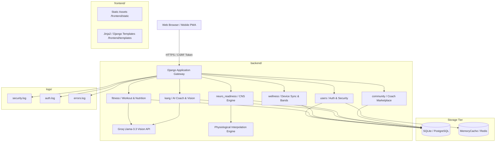

# EVOLV Platform — Enterprise System Architecture

## 1. Architectural Pattern: Multi-Tier Monorepo

The EVOLV platform is engineered following the **Corporate Multi-Tier Monorepo Architecture**, providing strict physical and logical decoupling between presentation assets, server domain services, developer tooling, and operational telemetry.

---

## 2. Tier Breakdown

### 2.1 Presentation Tier (`frontend/`)
- **`templates/`**: Server-rendered SPA shell (`fit.html`) providing the mounting point for client-side routing, navigation, and visual styling.
- **`static/css/`**: Swiss Noir typography, Tailwind utility layers, and responsive UI components.
- **`static/js/`**: Client-side controllers:
  - `app.js`: Master application lifecycle and view orchestrator.
  - `hollowman.js`: Procedural 2D skeletal animation engine for exercise form visualization.
  - `neuro.js`: Interactive CNS reaction test timer and readiness chart visualizer.
  - `kang.js`: Conversational AI interface and live audio-visual feedback.
  - `api.js`: Unified HTTP client handling CSRF token extraction and centralized error handling.

### 2.2 Backend Domain Tier (`backend/`)
- **`Fit_AI/`**: Application configuration core:
  - `settings.py`: Multi-tier path resolution (`BASE_DIR`, `PROJECT_ROOT`), security headers, cache policies, and logging handlers.
  - `security.py`: Centralized input validation, E.164 phone verification, Pillow image integrity inspection, and text sanitization.
  - `rate_limiter.py`: Sliding-window rate limiter backing public endpoints.
- **`users/`**: Identity management, cryptographic 6-digit OTP service, guest sessions, and fitness profiles.
- **`fitness/`**: Workout generation engine, meal vision analysis via Groq, calorie/macro trackers.
- **`wellness/`**: Smart band sync simulation, habit metrics (water, steps, sleep), and QR desktop-to-mobile pairing.
- **`kang/`**: KANG AI orchestrator, LLM prompt engineering, multi-turn chat sessions, and pose correction.
- **`neuro_readiness/`**: Deterministic physiological scoring engine calculating sleep, HRV, RHR, reaction time, and training load readiness.
- **`community/`**: Coach certification profiles, direct hire requests, and curated fitness tips.

### 2.3 Documentation Tier (`docs/`)
- Enterprise architectural standards, directory guides, and REST API contracts.

### 2.4 Developer Tooling Tier (`scripts/`)
- Platform bootstrapping, test runners, and database migration helpers.

### 2.5 Telemetry & Audit Tier (`logs/`)
- Rotating audit logs for authentication events, security anomalies, and unhandled server exceptions.
